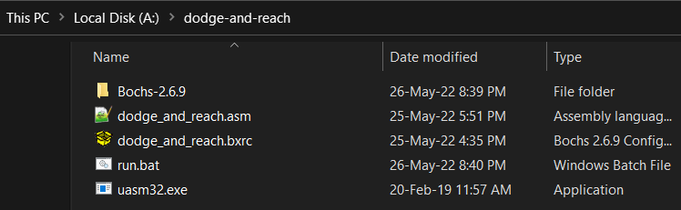
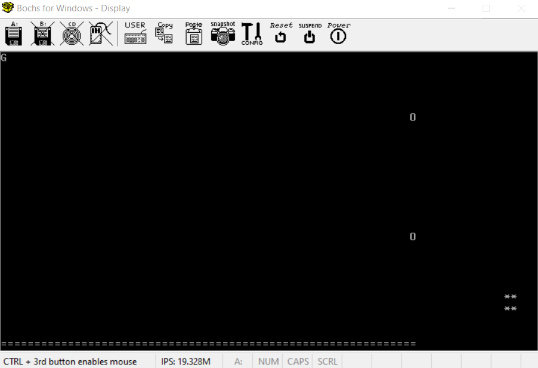

## Bootloader game - Dodge and Reach

Proiectul meu este un joculeț in care utilizatorul controlează un avatar, acesta pleacă dintr-un punct și trebuie să ajungă la un alt punct într-un timp limită și evitând proiectilele ce se izbesc de pereți.

### Funcționalitățile implementate:
- avatarul ce trebuie controlat utilizând tastele W, A, S, D
- punctul la care trebuie să ajung și pe care l-am numit gate
- proiectilele care se mișcă de-a lungul axei X și se întorc odată ce ating pereții
- timer-ul corelat cu atingerea pereților a proiectilelor
- terminarea jocului în cazurile:
	- când a fost atins gate-ul cu succes în timpul dat - câștigarea jocului
	- când gate-ul nu a fost atins, iar timpul a expirat - pierderea jocului
	- când avatarul s-a ciocnit cu unul dintre proiectile - pierderea jocului

**Fiecare funcție din fișierul .asm este comentată și indică ce funcționalitate implementează!**

### Implementare

Pentru implementare am folosit limbajul Assembly, mai exact, compilatorul uasm32 și am vizualizat rezultatul în mașina virtuală Bochs 2.6.9.

### Obținere programe necesare lansării în Windows

1. git clone https://gitlab.com/smp2022/331aa/dodge-and-reach.git
2. cd până în directorul clonat /dodge-and-reach
3. 'start Bochs-2.6.9.exe' în cmd și instalarea programului în același folder

Folder-ul /dodge-and-reach ar trebui să conțină obligatoriu următoarele fișiere: 

### Executare în Windows

Pentru executarea programului, odată ce sunteți în folderul /dodge-and-reach, rulați fișierul .bat prin comanda 'start run.bat'.

### Rezulatul obținut:

	 

Idei de jocuri asemanatoare:
- https://github.com/Sebmaster/bootloader-game/tree/game-bootloader
- https://github.com/mat-sz/pongloader
- https://github.com/flxbe/asm-space-invaders

				
				
		
	
	
